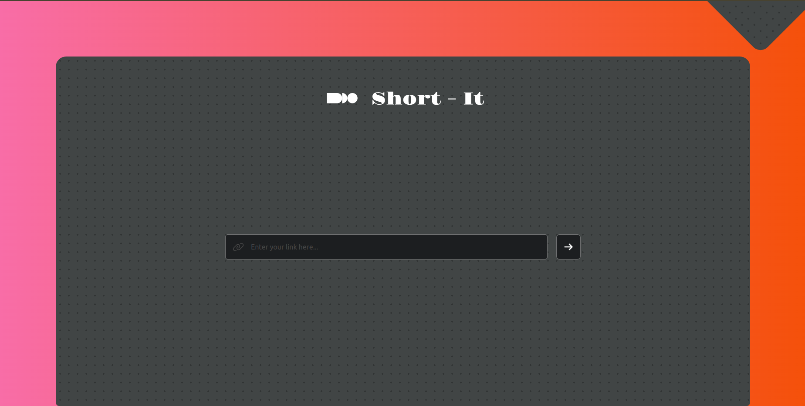
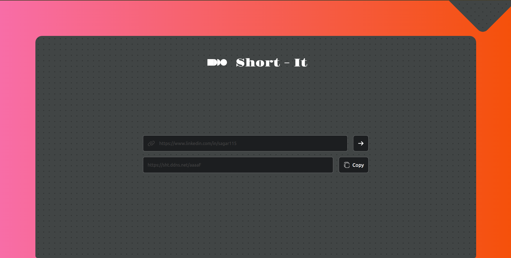

# Url Shortner

This is a simple URL shortener application that generates short, 5-character URLs using the Base64 encoding method. By default, each shortened URL expires automatically after 10 days. However, authenticated users can create URLs with a lifespan of up to 1 year. The application also includes backend analytics to track URL usage, but as this is the first phase, there is no authentication system or dashboard to display statistics yet. Future updates will include these features.

## Tech Stack

**Client:** React, Redux, TailwindCSS

**Server:** Node, Express

**Databse:** MongoDb, Redis

## Features

### Completed Features

- **URL Shortening**  
  Converts long URLs into short, unique identifiers for easy sharing and tracking.

- **Redirect Service**  
  Redirects users from shortened URLs to the original long URLs seamlessly.

- **Link Expiration**  
  Sets expiration dates for shortened URLs, with a default lifespan of 10 days for non-authenticated users.

- **Analytics**  
  Includes backend tracking for basic URL usage analytics, such as click tracking.

### Planned Features

- **Custom Short URLs**  
  Allows users to create personalized short URLs if the desired alias is available.

- **User Management**  
  Enables user registration and authentication for managing and organizing shortened URLs.

- **Enhanced Link Expiration**  
  Provides authenticated users the option to set URLs with a lifespan of up to 1 year.

- **API Support**  
  Offers a RESTful API for programmatic URL shortening, retrieval, and management.

- **QR Code Generation**  
  Generates QR codes for shortened URLs to facilitate offline sharing and access.

- **Advanced Analytics Dashboard**  
  Develops a user-friendly interface to display detailed analytics for URLs.


## Installation

Follow the steps below to set up the project locally:

### Prerequisites

- Ensure you have **Node.js** and **npm** installed on your system.
- Clone the repository:
  ```bash
  git clone https://github.com/sagar1952115/url-shortner.git
  ```

### Setting Up the Server

1 Navigate to the `server` directory:

```bash
cd url-shortner/server
```

2 Install the dependencies:

```bash
npm install
```

3 Start the server:

```bash
npm run dev
```

### Setting Up the Client

1 Navigate to the `client` directory:

```bash
cd ../client
```

2 Install the dependencies:

```bash
npm install
```

3 Start the client:

```bash
npm run dev
```

## Environment Configuration

This project requires two `.env` files: one for the **client** and one for the **server**. Each environment has specific configuration settings.

### Setting Up `.env` for Server

1. Navigate to the server directory:

   ```bash
   cd server
   ```

2. Create a .env file in the server directory and add the necessary environment variables.

Example .env for the server:

```bash
SENTRY_DSN="your-sentry-url"
NODE_ENV="development"
PORT=5000
REDIS_PASSWORD="your-redis-password"
BASE_URL="http://localhost:5000"
```

### Setting Up `.env` for Client

1. Navigate to the client directory:

   ```bash
   cd client
   ```

2. Create a .env file in the server directory and add the necessary environment variables.

Example .env for the client:

```bash
VITE_BASE_URL="your-server-base-url"
```

Make sure to replace the placeholder values with your actual configuration.

### Notes

- For local development, ensure the server and client `.env` files are configured with the correct URLs, ports, and any other environment-specific settings.
- You may need to restart both the server and client after modifying `.env` files to apply the new settings.

## Screenshots

 


## Demo

https://shrtt.netlify.app/

## 🔗 Links

[](https://getmehere.netlify.app)
[](https://www.linkedin.com/in/sagar115)

## Feedback

If you have any feedback, please reach out to me at sagarkumarme1@gmail.com
